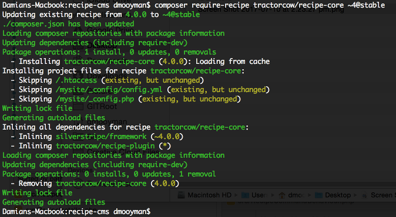

# SilverStripe recipe-plugin

## Introduction

This plugin enhances composer and allows for the installation of "silverstripe-recipe" packages.
These recipes allow for the following features:

 - The ability to provide project resource files. These are copied to the appropriate project root location
   on install, and can be safely modified by the developer. On subsequent updates to a later recipe,
   composer will inform the user if a project file has been updated, and will ensure new files are
   copied as they are introduced to the recipe.
 - Recipes are composable, so resources or dependencies that are required by multiple recipes can include one another,
   rather than having to duplicate content.
 - Recipes also can be used as a base composer project.
 - A `require-recipe` command to inline a recipe into the root composer.json, allowing the developer to customise the
   recipe dependencies without mandating the inclusion of all requirements directly.
 - An `upgrade-recipe` command to upgrade to a newer version of a recipe.

## Example output



## Creating a new project

Recipes can be introduced to any existing project (even if not created on a silverstripe base project)

```shell
$ composer init
$ composer require silverstripe/recipe-plugin ^0.1
$ composer require-recipe silverstripe/recipe-cms ^4.0@dev
````

Alternatively, instead of having to install the recipe-plugin manually, you can require the recipe
directly and inline this as a subsequent command. This is necessary to make the new commands available
to the command line.

```shell
$ composer init
$ composer require silverstripe/recipe-cms ^4.0@dev
$ composer upgrade-recipe silverstripe/recipe-cms
```

Alternatively you can create a new project based on an existing recipe

```shell
$ composer create-project silverstripe/recipe-cms ./myssproject ^4.0@dev
```

## Upgrading recipes

Any existing recipe, whether installed via `composer require` or `composer require-recipe` can be safely upgraded
via `composer upgrade-recipe`.

When upgrading a version constraint is recommended, but not necessary. If omitted, then the existing installed
version will be detected, and a safe default chosen.

```shell
$ composer upgrade-recipe silverstripe/recipe-cms ^1.0@dev
```

## Removing recipes

As installation of a recipe inlines all dependencies and passes ownership to the root project,
there is no automatic removal process. To remove a recipe, you should manually remove any
required module that is no longer desired via `composer remove <module>`.

The `provide` reference to the recipe can also be safely removed, although it has no practical result
other than to disable future calls to `upgrade-recipe` on this recipe.

## Installing or upgrading recipes without inlining them

If desired, the optional inline behaviour of recipes can be omitted. Simply use the composer commands `require` and
`update` in place of `require-recipe` and `update-recipe` respectively. This will not disable the project files
feature, but will not inline the recipe directly, keeping your root composer.json from getting cluttered.

If you have already inlined a recipe, it will be necessary to manually remove any undesired inlined requirements
manually, and the recipe will need to be included with `require` subsequently.

Note that using this method it's not necessary to include the `silverstripe/recipe-plugin` in the root project
for this to work.

## Recipe composer.json schema

Recipe types should follow the following rules:

 - No mandatory resources, other than project files.
 - Recipes must not rely on `autoload` as this are discarded on inline.
   Likewise any `*-dev` or other root-only options should not be used, as these are ignored outside of the root project.
   The exception to this is when these values are useful as a base project only.
 - The `type` must be `silverstripe-recipe`
 - The `require` must have `silverstripe/recipe-plugin` as a dependency.
 - `extra.project-files` must be declared as a list of wildcard patterns, matching the files in the recipe root
   as they should be copied to the root project. The relative paths of these resources are equivalent.

An example recipe:

```json
{
    "name": "silverstripe/example-recipe",
    "description": "Example silverstripe recipe",
    "type": "silverstripe-recipe",
    "require": {
        "silverstripe/recipe-plugin": "^0.1",
        "silverstripe/recipe-cms": "^4.0",
        "silverstripe/blog": "^3.0@dev",
        "silverstripe/lumberjack": "^2.1@dev",
    },
    "extra": {
        "project-files": [
            "mysite/_config/*.yml",
            "mysite/code/MyBlogPage.php"
        ]
    },
    "prefer-stable": true,
    "minimum-stability": "dev"
}
```
